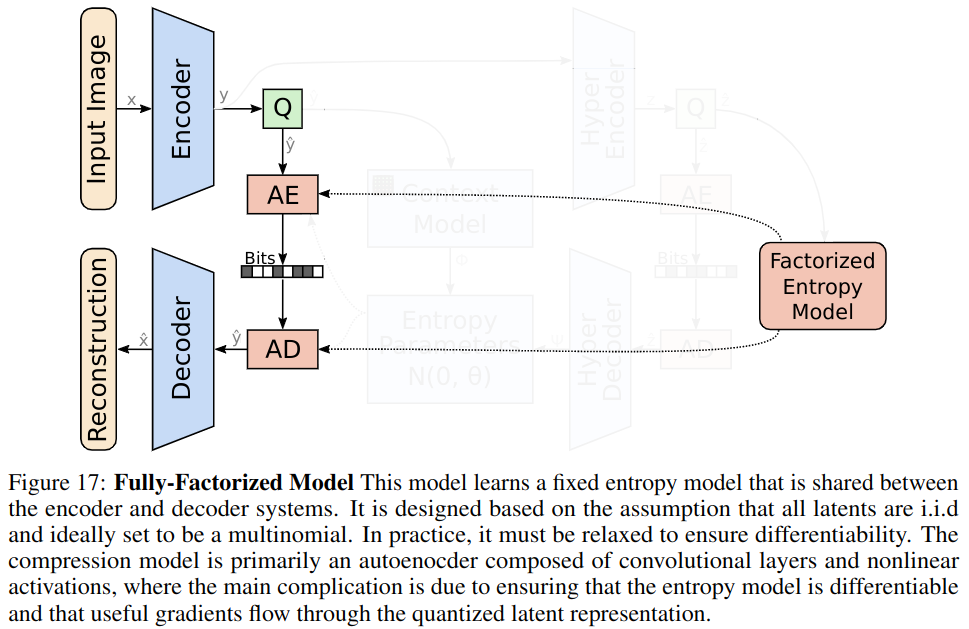
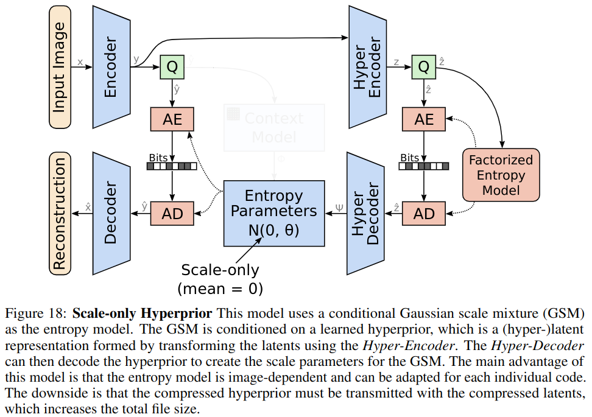
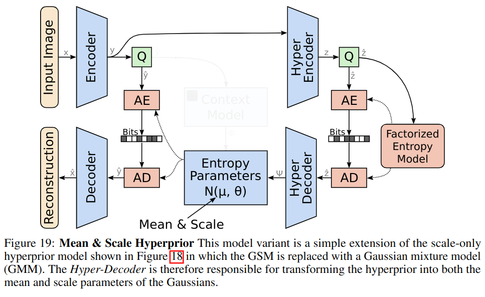
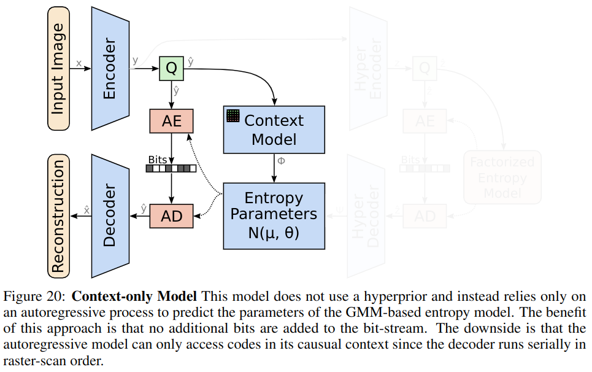
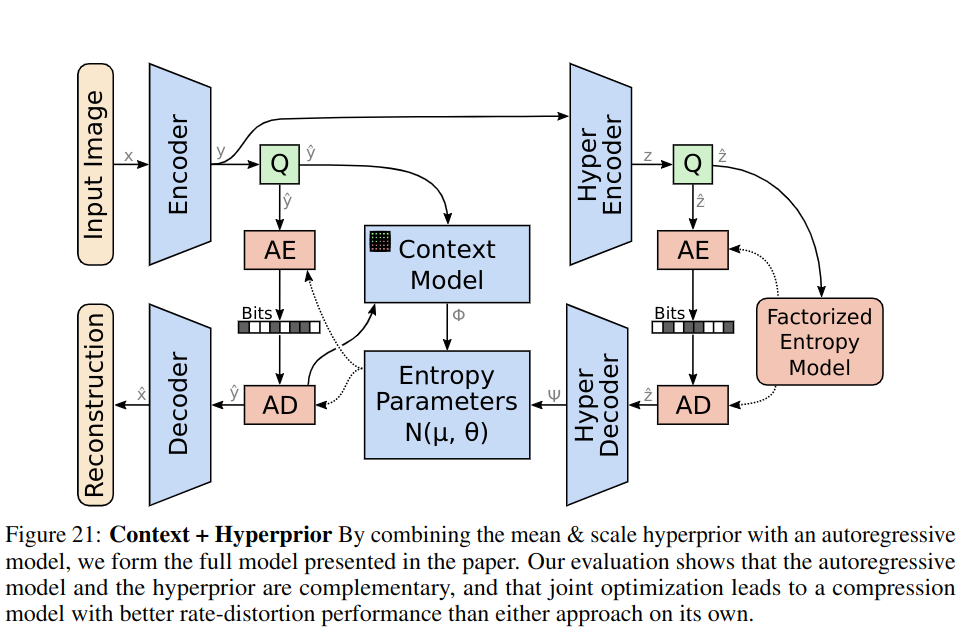
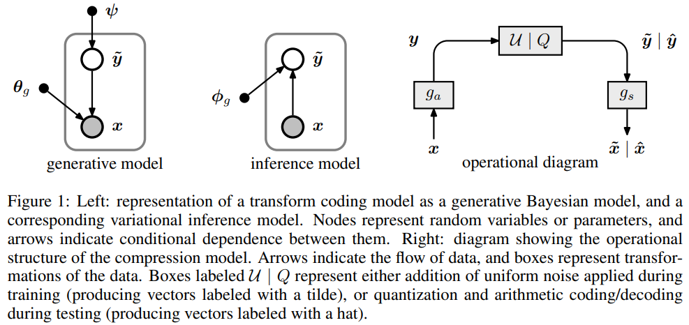
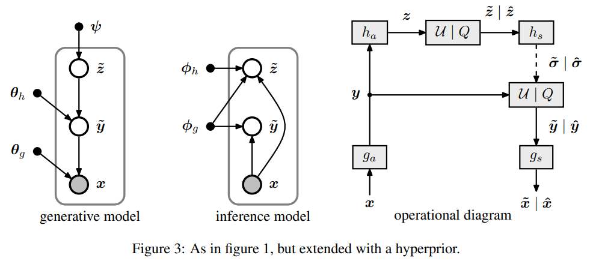

# Image-Compression-Paper

Example

## Motivation
## Contribution

Variable-Rate Deep Image Compression through Spatially-Adaptive Feature Transform.

## Motivation
## Contribution

[ICCV 2021](https://openaccess.thecvf.com/content/ICCV2021/papers/Song_Variable-Rate_Deep_Image_Compression_Through_Spatially-Adaptive_Feature_Transform_ICCV_2021_paper.pdf)

Learning Accurate Entropy Model with Global Reference for Image Compression. 

## Motivation
    1. Existing methods only combined hyperprior with local context in the entropy model.
## Contribution
    1. Proposed a global reference model for image compression to effectively leverage both the local and global context information
    2. A mean-shift GDN module

[ICLR 2021](https://arxiv.org/pdf/2010.08321.pdf)  

Learned image compression with discretized gaussian mixture likelihoods and attention modules. 

## Motivation
## Contribution

[CVPR 2020](https://openaccess.thecvf.com/content_CVPR_2020/papers/Cheng_Learned_Image_Compression_With_Discretized_Gaussian_Mixture_Likelihoods_and_Attention_CVPR_2020_paper.pdf)  

Transformer-based Image Compression

## Motivation
## Contribution

[arxiv 2021](https://arxiv.org/pdf/2111.06707.pdf)

Joint autoregressive and hierarchical priors for learned image compression. 

## Motivation
    1. The work was motivated by the hierarchical entropy model(which publiced in ICLR2018).

## Contribution
    1. Generalize the hierarchical Gaussian scale mixture model into conditional Gaussian mixture model
    2. Assess the compression performance of both models 

## Ablation Study

  

  
   
   
  
  

[NIPS 2018](https://arxiv.org/pdf/1809.02736.pdf)  

Variational image compression with a scale hyperprior.

## Motivation
<!-- 1. HEVC models images with variable size blocks, unlike JPEG which uses fixed size blocks. It can be used to achieve more efficient image compression, because HEVC is free to select a partitioning for each image. HEVC only need to transmit the side information between the encoder and decoder.By this way, the amount of side information sent is much smaller,on average, than the reduction of code length. -->

1. Side information are largely unexplored in existing CNN-based image compression models
2. Side information can be used to achieve more efficient image compression
3. The side information of conventional image compression models is hand-designed

## Contribution
1. This paper proposed a model to learn the latent representation of the entropy model.

## Method

[ICLR 2018](https://arxiv.org/pdf/1802.01436.pdf)

End-to-end Optimized Image Compression. 

## Motivation
## Contribution

[ICLR2017](https://arxiv.org/pdf/1611.01704.pdf)  

End-to-end optimization of nonlinear transform codes for perceptual quality. 

## Motivation
## Contribution

[PCS 2016](https://ieeexplore.ieee.org/stamp/stamp.jsp?tp=&arnumber=7906310)  

The JPEG still picture compression standard. 

## Motivation
## Contribution

[CACM 1991](https://dl.acm.org/doi/pdf/10.1145/103085.103089)  

Overview of the H.264/AVC video coding standard. 

## Motivation
## Contribution

[TCSVT 2003](https://ieeexplore.ieee.org/stamp/stamp.jsp?tp=&arnumber=1218189)

Context-Based Adaptive Binary Arithmetic Coding in the H.264/AVC Video Compression Standard

## Motivation

## Contribution
   1. This paper conbined an adaptive binary arithmetic coding technique with a well-designed set of context models.
   2. 

[TCSVT 2003](https://ieeexplore.ieee.org/stamp/stamp.jsp?arnumber=1218195)

# 360&deg;Image Metrics
A framework to evaluate omnidirectional video coding schemes(SPSNR). [ISMAR 2015](https://ieeexplore.ieee.org/abstract/document/7328056)  
Weighted-to-Spherically-Uniform Quality Evaluation for Omnidirectional Video. [SPL 2017](https://ieeexplore.ieee.org/abstract/document/7961186)  

# Image-Compression-Normalization
Density modeling of images using a generalized normalization transformation. [ICLR2016](https://arxiv.org/pdf/1511.06281)  

# Sample-Points
ICOSAHEDRAL DISCRETIZATION OF THE TWO-SPHERE*. [SIAM 2018](https://epubs.siam.org/doi/pdf/10.1137/0722066)  

# Spherical-Convolution-Paper
Spherenet: Learning spherical representations for detection and classification in omnidirectional images.[ECCV 2018](https://openaccess.thecvf.com/content_ECCV_2018/papers/Benjamin_Coors_SphereNet_Learning_Spherical_ECCV_2018_paper.pdf)  
Spherical CNNs.[ICLR2018](https://arxiv.org/pdf/1801.10130.pdf)  
Kernel Transformer Networks for Compact Spherical Convolution.[CVPR 2019](https://openaccess.thecvf.com/content_CVPR_2019/papers/Su_Kernel_Transformer_Networks_for_Compact_Spherical_Convolution_CVPR_2019_paper.pdf)  
SpherePHD: Applying CNNs on a Spherical PolyHeDron Representation of 360deg Images. [CVPR 2019](https://openaccess.thecvf.com/content_CVPR_2019/papers/Lee_SpherePHD_Applying_CNNs_on_a_Spherical_PolyHeDron_Representation_of_360deg_CVPR_2019_paper.pdf)  
Spherical CNNs on unstructured grids.[ICLR 2019](https://arxiv.org/pdf/1901.02039.pdf)  
Rotation Equivariant Graph Convolutional Network for Spherical Image Classification[cvpr2020](https://openaccess.thecvf.com/content_CVPR_2020/papers/Yang_Rotation_Equivariant_Graph_Convolutional_Network_for_Spherical_Image_Classification_CVPR_2020_paper.pdf)  
DeepSphere: a graph-based spherical CNN. [ICLR 2020](https://arxiv.org/pdf/2012.15000)  

# Curve-Surface-Convolution-Paper
Subdivision-based mesh convolution networks.[TOG2022](https://dl.acm.org/doi/pdf/10.1145/3506694)

# 360&deg;Compression-Paper
Pseudocylindrical Convolutions for Learned Omnidirectional Image Compression[arxiv 2021](https://arxiv.org/pdf/2112.13227.pdf)  
Spherical coordinates transform-based motion model for panoramic video coding.[JETCS2019](https://ieeexplore.ieee.org/stamp/stamp.jsp?tp=&arnumber=8629996)  
Learning compressible 360° video isomers.[CVPR2018](https://openaccess.thecvf.com/content_cvpr_2018/papers/Su_Learning_Compressible_360deg_CVPR_2018_paper.pdf)  
OSLO: On-the-Sphere Learning for Omnidirectional Images and Its Application to 360-Degree Image Compression[TIP 2022](https://ieeexplore.ieee.org/abstract/document/9875033)

OSLO: On-the-Sphere Learning for Omnidirectional Images and Its Application to 360-Degree Image Compression

## Motivation:
    Existing spherical CNN didn't contain all these three properities:  
    1. rotation equivariance  
    2. expressive filter  
    3. computational efficiency 

## Contribution:
    1. They proposed a new convolution operation on the sphere based on the HEALPix uniform sampling.  
    2. They adapt existing standard CNN techniques(stride, iterative aggregation and pixel shuffling) to the spherical domain.  
    3. Apply the new framework to the task of omnidirectional image compression.  

[TIP 2022](https://ieeexplore.ieee.org/abstract/document/9875033)

# Projection-Paper
[JVET-F1003](https://www.researchgate.net/publication/326381357_JVET-F1003_Algorithm_descriptions_of_projection_format_conversion_and_video_quality_metrics_in_360Lib)  
Distributing many points on a sphere.[kuleuven1997](https://perswww.kuleuven.be/~u0017946/publications/Papers97/art97a-Saff-Kuijlaars-MI/Saff-Kuijlaars-MathIntel97.pdf)  
Squaring the circle in panoramas.[ICCV2005](https://ieeexplore.ieee.org/stamp/stamp.jsp?tp=&arnumber=1544869)  
Measurement of areas on a sphere using Fibonacci and latitude–longitude lattices.[Mathematical Geosciences 2009](https://link.springer.com/content/pdf/10.1007/s11004-009-9257-x.pdf)  
Map Projections:: Theory and Applications [Routledge 1990](https://www.taylorfrancis.com/books/mono/10.1201/9780203748121/map-projections-ii-pearson)  
Map projections used by the U.S. Geological Survey [US Government Printing Office 1982](https://pubs.usgs.gov/bul/1532/report.pdf)

# 360&deg;Object Detection
Spherical criteria for fast and accurate 360 object detection.[AAAI2019](https://ojs.aaai.org/index.php/AAAI/article/view/6995)  
Kernel transformer networks for compact spherical convolution.[cvpr2019](https://openaccess.thecvf.com/content_CVPR_2019/papers/Su_Kernel_Transformer_Networks_for_Compact_Spherical_Convolution_CVPR_2019_paper.pdf)  
Object detection in equirectangular panorama.[ICPR2018](https://arxiv.org/pdf/1805.08009.pdf)  
Eliminating the blind spot: Adapting 3d object detection and monocular depth estimation to 360 panoramic imagery.[ECCV2018](https://arxiv.org/pdf/1808.06253v1.pdf)

# 360&deg;Salient Object Detection
View-aware Salient Object Detection for 360° Omnidirectional Image[TMM 2022](https://arxiv.org/pdf/2209.13222)

# Overview
Deep Learning for Omnidirectional Vision: A Survey and New Perspectives.[arxiv2022](https://arxiv.org/pdf/2205.10468.pdf)  
State-of-the-art in 360 video/image processing: Perception, assessment and compression.[JSTSP2020](https://ieeexplore.ieee.org/stamp/stamp.jsp?tp=&arnumber=8960364)  
Recent advances in omnidirectional video coding for virtual reality: Projection and evaluation.[SP2018](https://reader.elsevier.com/reader/sd/pii/S0165168418300057?token=91255BF9EFC05C00E5DBA290E37F10CE94943DC5DB754B4B74BE1E7658A9C062AD8F74E85C089DA3B7F81A4C81E655C5&originRegion=us-east-1&originCreation=20220927212654)

# Object Detection Survey

Deep Learning for Generic Object Detection: A Survey

## Motivation
   1. Although tremendous progress has been achieved during past 5 years, but they didn't find comprehensive surveys of Object Detection.

## Contribution

## Definition of Object Detection 
Given an image, determine whether or not there are instances of 

[IJCV 2019](https://link.springer.com/article/10.1007/s11263-019-01247-4)

# Transformer

An Image is Worth 16x16 Words: Transformers for Image Recognition at Scale

[ICLR 2021](https://arxiv.org/pdf/2010.11929.pdf)

Involution: Inverting the Inherence of Convolution for Visual Recognition

## Motivation
    Advantage of existing CNN structure
    1. Spatial-agnostic(spatial-agnostic guarantees the efficiency of convolution kernels by reusing them among different locations and pursues translation equivalence)
    2. Channel-specific(channel-specific is responsible for collecting diverse information encoded in different channels)

    Disadvantage of existing CNN structure
    1. Original CNN structure deprives convolution kernels of the ability to adapt to diverse visual patterns with respect to different spatial positions
    2. Locality constrains the receptive field of convolution, posing challenges for capturing long-range spatial interactions in a single shot. 

## Contribution
   1. Breaking through the existing inductive biases of convolution
   2. Unifying the view of self-attention and convolution

[CVPR 2021](https://arxiv.org/abs/2103.06255)

# LossLess Compression

The Hitchhiker’s Guide to Compression[link](https://go-compression.github.io/)  
CABAC tutorial[link](http://bertolami.com/index.php?engine=blog&content=posts&detail=arithmetic-coding)

